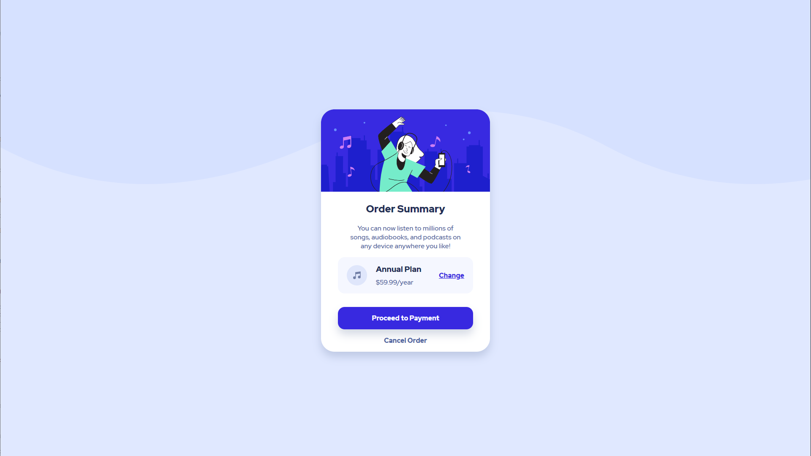

# Frontend Mentor - Order summary card solution

This is a solution to the [Order summary card challenge on Frontend Mentor](https://www.frontendmentor.io/challenges/order-summary-component-QlPmajDUj). Frontend Mentor challenges help you improve your coding skills by building realistic projects. 

## Table of contents

- [Overview](#overview)
  - [The challenge](#the-challenge)
  - [Screenshot](#screenshot)
  - [Links](#links)
- [My process](#my-process)
  - [Built with](#built-with)
  - [Continued development](#continued-development)
- [Author](#author)

## Overview

### The challenge

Users should be able to:

- See hover states for interactive elements

### Screenshot

### Links

- [Solution URL](https://www.frontendmentor.io/solutions/order-summary-component-using-flexbox-1uM_yHabO)
- [Live Site URL](https://jolly-panini-675e73.netlify.app/)

## My process

### Built with

- Semantic HTML5 markup
- CSS custom properties
- Flexbox
- Mobile-first workflow

### Continued development

I want to continue focusing on writing clean CSS, making sure not to create redundant styles and continuing mobile-first workflow

## Author

- Website - [Add your name here](https://www.your-site.com)

